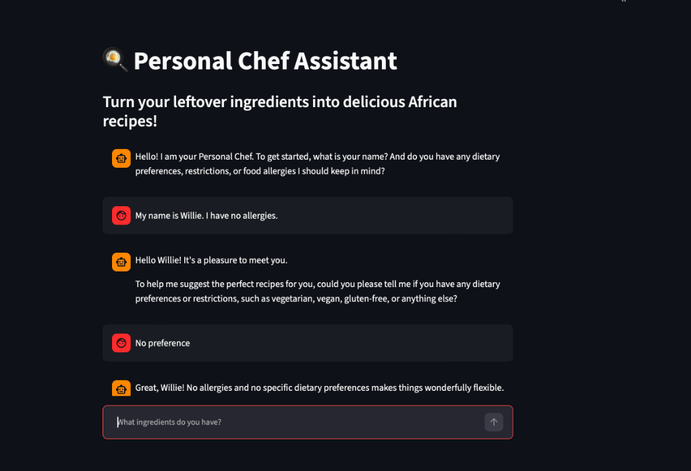
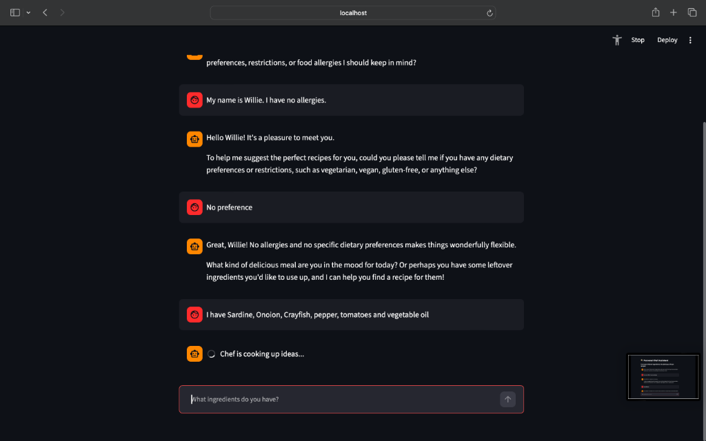
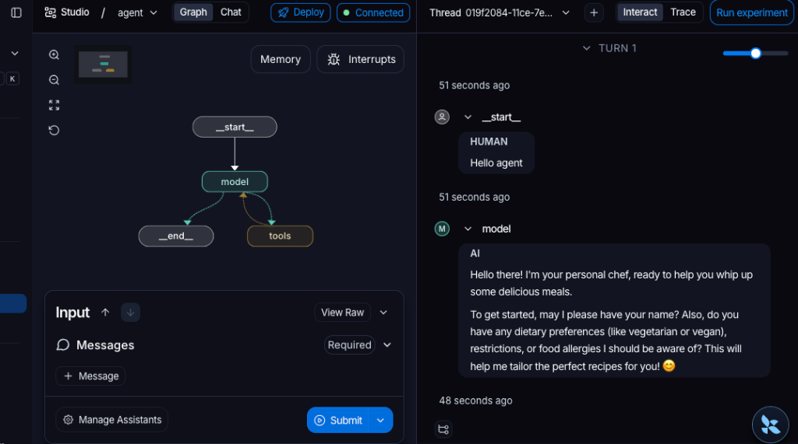

# Personal Chef Assistant

An AI-powered personal chef assistant that helps you turn leftover kitchen ingredients into delicious recipes. The assistant uses Google Gemini, Tavily Search, and LangChain with built-in memory checkpointers to remember your preferences and answer follow-up questions.

Developed by **Inimfon Willie**, inspired by the *Foundation: Introduction to LangChain - Python* course from **LangChain Academy**.

---

## Demo Screenshots

Here is the Personal Chef Assistant running locally in the browser and visualized in LangGraph Studio:

| Initial Greeting & Preferences Setup | Recipe Search & Interactive Chat |
| --- | --- |
|  |  |

### LangGraph Studio Visualization



---


## Features

- **Leftover Ingredient Matcher**: Recommends practical recipes based on whatever leftover ingredients you currently have.
- **Stateful Memory**: Uses LangGraph's native `MemorySaver` checkpointer to remember your name, dietary preferences, and allergies across conversation turns.
- **Smart Web Search**: Integrates Tavily Search API to fetch high-quality online recipe instructions.
- **Modular Design**: Separates the backend agent service (`chef_service.py`) from the frontend UI (`app.py`).

---

## Project Structure

```text
├── UI/
│   └── app.py            # Streamlit Chat interface
├── notebook/
│   └── chef_service.py   # LangChain agent logic & search tools
├── .env                  # API Credentials & tracing config (ignored by git)
├── langgraph.json        # LangGraph CLI config for local development
├── pyproject.toml        # Project dependencies managed by uv
└── README.md

```

---

## Setup & Run Instructions

### Prerequisite

Make sure you have [uv](https://github.com/astral-sh/uv) installed (Astral's fast Python packaging tool).

### 1. Clone the repository and navigate to the project directory:
```bash
cd AI_personal_chef
```

### 2. Configure Environment Variables:
Create a `.env` file in the root directory and add your API keys:
```env
GEMINI_API_KEY="your_gemini_api_key"
TAVILY_API_KEY="your_tavily_api_key"

# LangSmith Tracing config
LANGCHAIN_TRACING_V2=true
LANGCHAIN_API_KEY="your_langsmith_api_key"
LANGCHAIN_PROJECT="personal_chef"
```

### 3. Run the Streamlit Interface:
`uv` will automatically set up the virtual environment, install dependencies, and run the server:
```bash
uv run streamlit run UI/app.py
```
Open `http://localhost:8501` in your browser to start chatting with your Personal Chef!

### 4. Run LangGraph Studio Locally (Optional for Tracing & Debugging):
To visualize your agent graph and debug runs locally, start the LangGraph local API dev server:
```bash
uv run langgraph dev
```
*(If you get a connection block in Safari, consider running the command with the `--tunnel` flag or opening the URL in Chrome: `uv run langgraph dev --tunnel`)*

